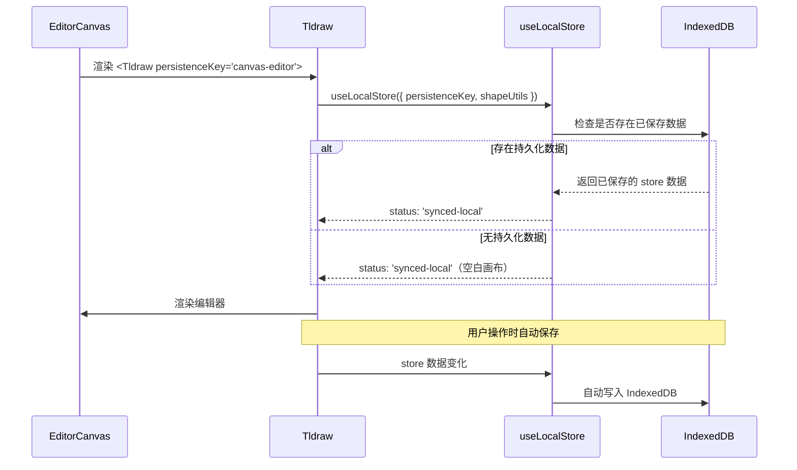

# 设计文档：画布持久化

## 概述

本设计利用 tldraw v4 内置的 `persistenceKey` 属性实现画布数据的自动持久化。tldraw 内部通过 `useLocalStore` hook 将数据保存到浏览器的 IndexedDB 中，并支持跨标签页同步。由于 `persistenceKey` 与 `shapeUtils` 在同一组件层级传递，自定义的 `HybridHtmlShapeUtil` 会被自动注册到持久化 store 中，无需手动创建 store。

这是最小化的实现方案——只需在 `<Tldraw>` 组件上添加一个 `persistenceKey` 属性即可。

## 架构

### 当前架构

```
AIPromptPanel → 生成 HTML → EditorCanvas → Tldraw（无持久化）→ 刷新后数据丢失
```

### 目标架构

```
AIPromptPanel → 生成 HTML → EditorCanvas → Tldraw(persistenceKey) → IndexedDB 自动持久化
                                                                    ↓
                                                              刷新后自动恢复
```

### 设计决策

**选择 `persistenceKey` 而非手动 `createTLStore` + `getSnapshot`/`loadSnapshot` 方案：**

1. tldraw v4 的 `<Tldraw>` 组件原生支持 `persistenceKey` 属性
2. 内部使用 `useLocalStore` hook，自动处理 IndexedDB 存储和跨标签页同步
3. `shapeUtils`（包括 `HybridHtmlShapeUtil`）在同一调用链中传递给 `useLocalStore`，确保自定义形状正确序列化
4. 内部已处理加载状态（loading → synced-local），通过 `LoadingScreen` 组件展示
5. 代码改动量最小——仅需添加一个属性

**选择 IndexedDB 而非 localStorage：**

tldraw 内部使用 IndexedDB（通过 `useLocalStore`），相比 localStorage：
- 无 5MB 大小限制
- 支持结构化数据存储
- 异步操作不阻塞主线程
- 更适合存储大量 HTML 形状数据

## 组件与接口

### 修改的组件

#### EditorCanvas.tsx

唯一需要修改的文件。在 `<Tldraw>` 组件上添加 `persistenceKey` 属性：

```tsx
// 修改前
<Tldraw
  onMount={handleMount}
  shapeUtils={[HybridHtmlShapeUtil]}
  tools={customTools}
  overrides={uiOverrides}
  components={customComponents}
/>

// 修改后
<Tldraw
  persistenceKey="canvas-editor"
  onMount={handleMount}
  shapeUtils={[HybridHtmlShapeUtil]}
  tools={customTools}
  overrides={uiOverrides}
  components={customComponents}
/>
```

### 常量定义

```tsx
/** 持久化存储的唯一标识符 */
const PERSISTENCE_KEY = 'canvas-editor';
```

### 内部工作流程（由 tldraw 自动处理）



## 数据模型

### 持久化数据结构

tldraw 内部管理的持久化数据包含：

```typescript
// tldraw 内部的 store 数据结构（由框架自动管理）
interface TLStoreData {
  // 文档数据
  document: {
    pages: TLPage[];           // 页面列表
    shapes: TLShape[];         // 所有形状（包括 HtmlShape）
    bindings: TLBinding[];     // 形状间的绑定关系
    assets: TLAsset[];         // 资源文件
  };
  // 会话数据
  session: {
    currentPageId: string;     // 当前页面 ID
    camera: { x: number; y: number; z: number }; // 相机位置
    selectedShapeIds: string[]; // 选中的形状
  };
}
```

### HybridHtmlShape 持久化属性

以下自定义属性会被自动持久化：

```typescript
{
  html: string;              // HTML 内容
  css: string;               // CSS 样式
  js: string;                // JavaScript 代码
  mode: 'preview' | 'edit';  // 显示模式
  overrides: ElementOverride[]; // 元素覆盖
  designSystem?: string;     // 设计系统
  viewport?: ViewportConfig; // 视口配置
  w: number;                 // 宽度
  h: number;                 // 高度
}
```


## 正确性属性

*属性是一种在系统所有有效执行中都应成立的特征或行为——本质上是关于系统应该做什么的形式化陈述。属性是人类可读规范与机器可验证正确性保证之间的桥梁。*

基于需求分析，本功能有两个可测试的正确性属性：

### Property 1: JSON 序列化往返一致性

*For any* 有效的 HybridHtmlShape 属性对象（包含任意 html、css、js、mode、overrides、viewport、w、h），对其执行 `JSON.stringify` 然后 `JSON.parse` 后应产生与原始对象深度相等的结果。

**Validates: Requirements 5.1**

### Property 2: HybridHtmlShape 持久化往返一致性

*For any* 包含任意数量 HybridHtmlShape 的 tldraw store，执行 `getSnapshot` 获取快照后，在新的 store 上执行 `loadSnapshot` 加载该快照，新 store 中的所有 HybridHtmlShape 的属性应与原始 store 中的完全一致。

**Validates: Requirements 2.1, 2.2, 3.1, 5.2**

## 错误处理

| 场景 | 处理方式 | 负责方 |
|------|---------|--------|
| IndexedDB 不可用 | tldraw 内部降级处理，编辑器仍可正常使用但不持久化 | tldraw |
| 持久化数据损坏 | tldraw 内部处理，通过 LoadingScreen 组件展示错误状态 | tldraw |
| IndexedDB 存储空间不足 | 浏览器级别的限制，tldraw 内部处理写入失败 | tldraw/浏览器 |
| 跨标签页冲突 | tldraw 的 useLocalStore 内置跨标签页同步机制 | tldraw |

由于使用 `persistenceKey` 方案，所有错误处理均由 tldraw 框架内部管理，无需额外的自定义错误处理代码。

## 测试策略

### 属性测试（Property-Based Testing）

使用项目中已有的 `fast-check` 库进行属性测试。

- **Property 1**: 生成随机的 HybridHtmlShape 属性对象，验证 JSON 序列化往返一致性
  - 最少 100 次迭代
  - Tag: **Feature: canvas-persistence, Property 1: JSON 序列化往返一致性**

- **Property 2**: 生成随机的 HybridHtmlShape 数据，创建 store 并添加形状，执行 getSnapshot/loadSnapshot，验证形状属性一致
  - 最少 100 次迭代
  - Tag: **Feature: canvas-persistence, Property 2: HybridHtmlShape 持久化往返一致性**

### 单元测试

- 验证 EditorCanvas 组件传递了 `persistenceKey` 属性给 Tldraw
- 验证 `PERSISTENCE_KEY` 常量值正确
- 验证组件在无持久化数据时正常渲染

### 测试工具

- **属性测试库**: fast-check（已在 devDependencies 中）
- **测试框架**: Jest + @testing-library/react（已配置）
- 每个正确性属性对应一个独立的属性测试
- 每个属性测试必须引用设计文档中的属性编号
