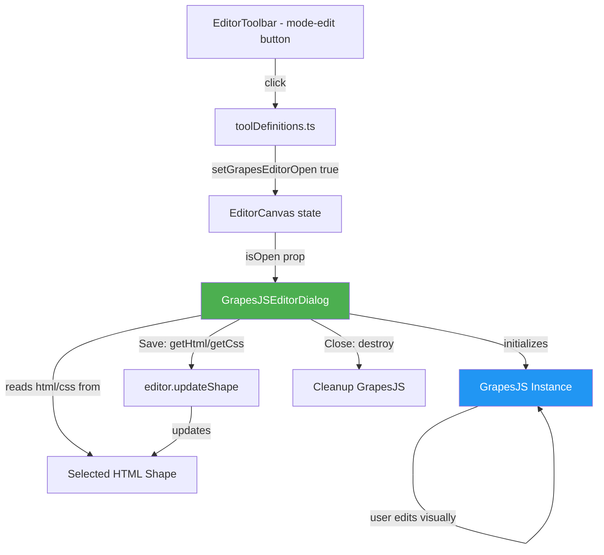

# Design Document: GrapesJS Editor Integration

## Overview

用 GrapesJS 全屏模态对话框替换当前自定义 EditMode 实现。采用与现有 `CodeEditorDialog` 相同的模态对话框模式：新建 `GrapesJSEditorDialog` 组件，在工具栏 "Edit" 按钮点击时打开，加载选中 HTML shape 的内容到 GrapesJS 编辑器，保存时通过 `editor.updateShape()` 更新 shape 属性。同时移除旧的 EditMode 及其所有依赖文件。

## Architecture



核心流程：
1. 用户点击 "Edit" → `toolDefinitions.ts` 检查是否有选中的 HTML shape → 设置 `grapesEditorOpen = true`
2. `EditorCanvas` 渲染 `GrapesJSEditorDialog`（传入 `isOpen`、`editor`、`onClose`）
3. Dialog 读取选中 shape 的 `html`/`css` 属性 → 初始化 GrapesJS 实例
4. 用户在 GrapesJS 中可视化编辑
5. 点击 Save → `editor.getHtml()` + `editor.getCss()` → `tldrawEditor.updateShape()` → 关闭
6. 点击 Close → `editor.destroy()` → 关闭，不保存

## Components and Interfaces

### GrapesJSEditorDialog

全屏模态对话框组件，模式与 `CodeEditorDialog` 一致。

```typescript
interface GrapesJSEditorDialogProps {
  isOpen: boolean;
  editor: Editor | null;  // tldraw Editor instance
  onClose: () => void;
}
```

职责：
- 从 tldraw editor 获取当前选中的 HTML shape
- 读取 shape 的 `html` 和 `css` 属性
- 渲染全屏模态遮罩 + 内容区域
- 内部管理 GrapesJS 实例的生命周期
- 提供 Save/Close 按钮

### GrapesJS 初始化配置

```typescript
const gjsEditor = grapesjs.init({
  container: containerElement,
  height: '100%',
  width: '100%',
  fromElement: false,
  components: shapeHtml,
  style: shapeCss,
  storageManager: false,
  assetManager: { assets: [] },
  panels: { defaults: [] },
  blockManager: {
    blocks: [
      { id: 'text', label: 'Text', content: '<p>Text block</p>', category: 'Basic' },
      { id: 'image', label: 'Image', content: { type: 'image' }, category: 'Basic' },
      { id: 'container', label: 'Container', content: '<div class="container"></div>', category: 'Basic' },
    ],
  },
});
```

### toolDefinitions.ts 修改

`mode-edit` 工具的 `onSelect` 回调改为打开 GrapesJS 对话框：

```typescript
tools['mode-edit'] = {
  id: 'mode-edit',
  label: 'Edit',
  icon: 'edit',
  kbd: 'e',
  onSelect: () => {
    if (configEditor) {
      const selectedShapes = configEditor.getSelectedShapes();
      if (selectedShapes.length === 1 && selectedShapes[0].type === 'html') {
        setGrapesEditorOpen(true);
      } else {
        alert('Please select an HTML shape to edit.');
      }
    }
  },
};
```

### EditorCanvas 修改

新增 `grapesEditorOpen` 状态和 `GrapesJSEditorDialog` 渲染：

```typescript
const [grapesEditorOpen, setGrapesEditorOpen] = useState(false);

// 在 JSX 中
<GrapesJSEditorDialog
  isOpen={grapesEditorOpen}
  editor={editor}
  onClose={() => setGrapesEditorOpen(false)}
/>
```

### ToolDefinitionsConfig 扩展

```typescript
export interface ToolDefinitionsConfig {
  // ... existing fields
  setGrapesEditorOpen: (open: boolean) => void;
}
```

### HybridHtmlShapeUtil 简化

移除 `renderMode` 中的 `'edit'` case，移除 `EditMode` import，移除 `handleElementDrag`、`handleElementResize`、`handleOverrideAdd` 方法。`renderMode` 只保留 `'preview'` 和 `'split'`。

## Data Models

### Shape Props（无变化）

HTML shape 的 props 结构不变，`mode` 字段仍保留 `'edit'` 值的类型定义以保持向后兼容，但运行时不再使用 `'edit'` 模式渲染。

```typescript
props: {
  html: string;
  css: string;
  js: string;
  mode: 'preview' | 'edit' | 'split';
  overrides: ElementOverride[];
  viewport?: ViewportConfig;
  w: number;
  h: number;
}
```

### GrapesJS 编辑结果

```typescript
interface GrapesJSEditResult {
  html: string;
  css: string;
}
```

GrapesJS `editor.getHtml()` 返回 `string`，`editor.getCss()` 返回 `string | undefined`。保存时对 `getCss()` 做 `?? ''` 兜底。


## Correctness Properties

*A property is a characteristic or behavior that should hold true across all valid executions of a system — essentially, a formal statement about what the system should do. Properties serve as the bridge between human-readable specifications and machine-verifiable correctness guarantees.*

### Property 1: Save operation preserves extracted content

*For any* HTML and CSS content extracted from a GrapesJS editor instance, when the save operation executes, the `editor.updateShape()` call SHALL receive a props object where `html` equals the extracted HTML and `css` equals the extracted CSS (with undefined coerced to empty string).

**Validates: Requirements 2.2**

### Property 2: Edit action does not mutate shape mode props

*For any* set of HTML shapes on the tldraw canvas, when the "Edit" toolbar button is clicked, no shape's `mode` prop SHALL be changed. The GrapesJS dialog opens as an overlay without modifying any shape state.

**Validates: Requirements 6.1**

## Error Handling

| 场景 | 处理方式 |
|------|---------|
| 未选中 HTML shape 时点击 Edit | 显示 alert 提示用户选择 HTML shape |
| GrapesJS 初始化失败 | 捕获异常，显示错误信息，关闭对话框 |
| `editor.getCss()` 返回 undefined | 使用 `?? ''` 兜底为空字符串 |
| 对话框关闭时 GrapesJS 实例已被销毁 | destroy() 调用前检查实例是否存在 |
| tldraw editor 为 null | GrapesJSEditorDialog 在 editor 为 null 时不渲染 |

## Testing Strategy

### 单元测试（Unit Tests）

使用 Vitest + React Testing Library 测试以下场景：

1. `GrapesJSEditorDialog` 在 `isOpen=false` 时不渲染
2. `GrapesJSEditorDialog` 在 `isOpen=true` 时渲染模态遮罩和内容区域
3. 点击 Save 按钮调用 `editor.updateShape()` 并关闭对话框
4. 点击 Close 按钮调用 `onClose` 且不调用 `updateShape()`
5. 点击遮罩层调用 `onClose`
6. 未选中 HTML shape 时 `mode-edit` 工具显示 alert
7. GrapesJS 实例在对话框关闭时被 destroy
8. 对话框卸载时清理 GrapesJS 实例
9. `toolDefinitions` 中 `mode-edit` 不再调用 `updateAllHtmlShapes`

### 属性测试（Property-Based Tests）

使用 fast-check 库，每个属性测试至少运行 100 次迭代。

- **Property 1**: 生成随机 HTML/CSS 字符串对，模拟 GrapesJS 的 `getHtml()`/`getCss()` 返回值，验证 `updateShape()` 接收到的 props 与提取值一致
  - Tag: **Feature: grapesjs-editor-integration, Property 1: Save operation preserves extracted content**
- **Property 2**: 生成随机数量的 HTML shapes（各有随机 mode 值），模拟点击 Edit 按钮，验证所有 shape 的 mode 属性未被修改
  - Tag: **Feature: grapesjs-editor-integration, Property 2: Edit action does not mutate shape mode props**
