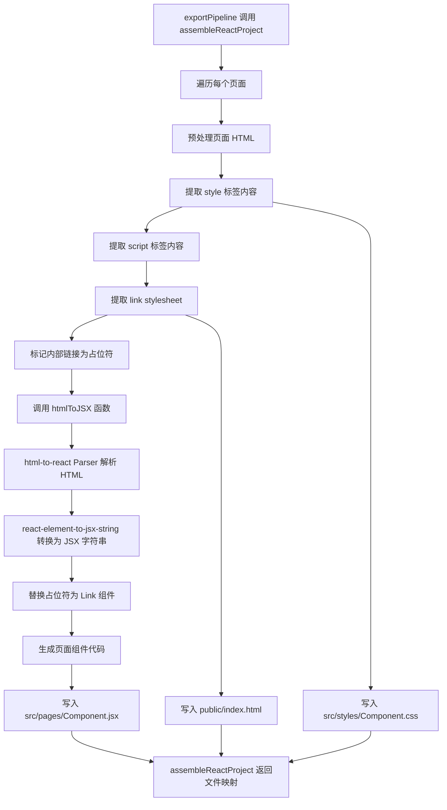

# 设计文档：html-to-react 导出改造

## 概述

本功能改造现有的 React 导出模块（`reactConverter.ts`），将 `dangerouslySetInnerHTML` 方案替换为使用 `html-to-react` 开源库进行 HTML→JSX 的**构建时转换**。

核心设计思路：
- 在**导出过程中**（Node.js 环境），使用 `html-to-react` 将 HTML 转换为 React 元素，再使用 `react-element-to-jsx-string` 将 React 元素转换为 JSX 字符串
- 生成的 React 组件**直接包含 JSX 代码**，不需要在浏览器中解析 HTML，也不依赖 html-to-react 作为运行时依赖
- 内部链接在转换前通过占位符标记，转换后替换为 `<Link>` 组件
- `<style>` 标签内容提取到独立 CSS 文件，`<script>` 标签内容提取到 `useEffect` 钩子
- CSS 采用独立文件策略：每个页面一个 CSS 文件 + 共享 CSS 文件，通过 `import` 引入
- `assembleReactProject` 函数签名保持不变，确保与导出管道的向后兼容

关键技术栈：
- `html-to-react` — 在导出工具中将 HTML 解析为 React 元素（仅在 Node.js 中使用）
- `react-element-to-jsx-string` — 将 React 元素转换为 JSX 字符串（仅在 Node.js 中使用）
- 生成的项目**不包含** html-to-react 依赖，只包含标准的 React 和 React Router 依赖

## 架构



**关键流程说明**：
1. **构建时转换**：`htmlToJSX()` 函数在导出过程中（Node.js 环境）运行，使用 html-to-react 和 react-element-to-jsx-string 将 HTML 转换为 JSX 字符串
2. **生成的组件**：包含直接的 JSX 代码，不包含 html-to-react 导入或 Parser 调用
3. **运行时依赖**：生成的项目只依赖 React 和 React Router，不依赖 html-to-react

改造范围限定在 `reactConverter.ts` 模块内部。导出管道（`exportPipeline.ts`）、CSS 提取器（`cssExtractor.ts`）、链接转换器（`linkConverter.ts`）等上游模块不需要修改。

### 生成的页面组件结构

改造前（当前方案）：
```jsx
function Home() {
  useEffect(() => { /* 原始 JS 代码 */ }, []);
  return (
    <div className="page-container">
      <style>{`/* 页面 CSS */`}</style>
      <div dangerouslySetInnerHTML={{ __html: `<!-- 原始 HTML -->` }} />
    </div>
  );
}
```

改造后（构建时 JSX 生成方案）：
```jsx
import React from 'react';
import { Link } from 'react-router-dom';
import { useEffect } from 'react';
import './styles/Home.css';

const Home = () => {
  useEffect(() => {
    // Execute page-specific JavaScript
    try {
      /* 提取的 JS 代码 */
    } catch (error) {
      console.error("Error executing page script:", error);
    }
  }, []);

  return (
    <>
      {/* 直接的 JSX 代码，由 html-to-react 在构建时生成 */}
      <div className="hero">
        <h1>Welcome</h1>
        <Link to="/products">View Products</Link>
      </div>
    </>
  );
};

export default Home;
```

**关键区别**：
- ❌ 不使用 `dangerouslySetInnerHTML`
- ❌ 不导入或使用 `html-to-react` 的 `Parser`
- ✅ 直接包含 JSX 代码（在导出过程中生成）
- ✅ 内部链接已转换为 `<Link>` 组件
- ✅ CSS 通过独立文件导入
- ✅ JavaScript 通过 `useEffect` 执行

## 组件与接口

### 改造的模块：reactConverter.ts

#### assembleReactProject（签名不变）

```typescript
export function assembleReactProject(
  pages: ProcessedPage[],
  sharedCSS: string,
  pageCSS: Map<string, string>,
  deps: { stylesheets: string[]; scripts: string[] },
  mockResult: MockGenerationResult,
  appName: string
): Map<string, string>
```

改造点：
- `generatePageComponent()` 内部逻辑完全重写，使用 `htmlToJSX()` 进行构建时转换
- `generatePackageJson()` **不添加** `html-to-react` 依赖（仅在导出工具中使用）
- `generatePublicIndexHtml()` 添加全局布局样式和 `<link>` 样式表
- 新增：为每个页面生成独立的 CSS 文件（`src/styles/{ComponentName}.css`）
- 新增：`htmlToJSX()` 函数在导出过程中将 HTML 转换为 JSX 字符串

#### htmlToJSX（新增核心函数）

```typescript
function htmlToJSX(html: string): string
```

**在导出过程中运行**（Node.js 环境），执行构建时转换：
1. 清理 HTML：移除 DOCTYPE、提取 body 内容
2. 使用 `html-to-react` 的 `Parser` 将 HTML 解析为 React 元素
3. 使用 `react-element-to-jsx-string` 将 React 元素转换为 JSX 字符串
4. 返回 JSX 字符串，嵌入到生成的组件代码中

**关键点**：
- 此函数仅在导出工具中运行，不在生成的项目中运行
- 使用 `require()` 动态导入 html-to-react（仅在 Node.js 中可用）
- 如果转换失败，回退到简单的字符串替换（`htmlToJSXFallback`）

#### generatePageComponent（重写）

```typescript
function generatePageComponent(
  page: ProcessedPage,
  componentName: string,
  pageCss: string
): string
```

改造后的生成逻辑：
1. 预处理页面 HTML：提取并移除 `<style>` 标签内容、提取并移除 `<script>` 标签内容
2. 标记内部链接：将 `<a data-react-link="true">` 替换为占位符 `<reactrouterlink>`
3. **调用 `htmlToJSX()` 进行构建时转换**：将 HTML 转换为 JSX 字符串
4. 替换占位符：将 `<reactrouterlink>` 替换为 `<Link>` 组件
5. 生成 import 语句：`React`、`Link`（如有内部链接）、`useEffect`（如有 JS）、页面 CSS 文件
6. 生成组件函数：直接返回 JSX 代码（不使用 Parser）

**生成的组件不包含**：
- ❌ `html-to-react` 导入
- ❌ `Parser` 实例化
- ❌ `parseWithInstructions()` 调用
- ❌ HTML 字符串常量

**生成的组件包含**：
- ✅ 直接的 JSX 代码
- ✅ `<Link>` 组件（已转换）
- ✅ CSS 文件导入
- ✅ `useEffect` 钩子（如有 JS）

#### 辅助函数

```typescript
/**
 * 从 HTML 字符串中提取所有 <style> 标签的内容
 * @returns { cleanedHtml: string, extractedCSS: string }
 */
function extractStyleTags(html: string): { cleanedHtml: string; extractedCSS: string }

/**
 * 从 HTML 字符串中提取所有 <script> 标签的内容
 * @returns { cleanedHtml: string, extractedJS: string }
 */
function extractScriptTags(html: string): { cleanedHtml: string; extractedJS: string }

/**
 * 从 HTML 字符串中提取所有 <link rel="stylesheet"> 的 href
 * @returns { cleanedHtml: string, stylesheetUrls: string[] }
 */
function extractLinkStylesheets(html: string): { cleanedHtml: string; stylesheetUrls: string[] }

/**
 * 检查 HTML 中是否包含内部链接标记（data-react-link）
 */
function hasInternalLinks(html: string): boolean

/**
 * 回退方案：简单的 HTML 到 JSX 字符串转换
 * 当 html-to-react 不可用或失败时使用
 */
function htmlToJSXFallback(html: string): string
```

#### generatePackageJson（不修改）

**重要**：生成的 `package.json` **不包含** `html-to-react` 依赖。

生成的项目只依赖：
```json
{
  "dependencies": {
    "react": "^18.2.0",
    "react-dom": "^18.2.0",
    "react-router-dom": "^6.20.0"
  }
}
```

html-to-react 仅在导出工具（`reactConverter.ts`）中使用，不是生成项目的运行时依赖。

#### generatePublicIndexHtml（修改）

新增内容：
- 从页面 HTML 中提取的 `<link rel="stylesheet">` 引用
- 全局布局样式：`body { margin: 0; } *, *::before, *::after { box-sizing: border-box; }`

### 不变的模块

以下模块不需要修改：
- `exportPipeline.ts` — 调用接口不变
- `cssExtractor.ts` — CSS 提取逻辑不变
- `linkConverter.ts` — 链接标记逻辑不变（已为 React 格式添加 `data-react-link` 标记）
- `staticAssembler.ts` — 静态导出不受影响
- `vueConverter.ts` — Vue 导出不受影响
- `zipBundler.ts` — ZIP 打包不受影响

## 数据模型

### 页面 HTML 预处理流程

```typescript
// 输入：来自管道的 ProcessedPage
interface ProcessedPage {
  name: string;
  html: string;   // 包含 style/script/link 标签的完整 HTML
  css: string;     // 页面原始 CSS（来自 shape 属性）
  js: string;      // 页面原始 JS（来自 shape 属性）
  designSystem?: string;
}

// 中间状态：HTML 预处理结果
interface HtmlPreprocessResult {
  cleanedHtml: string;       // 移除 style/script/link 标签后的 HTML
  extractedCSS: string;      // 从 <style> 标签提取的 CSS
  extractedJS: string;       // 从 <script> 标签提取的 JS
  stylesheetUrls: string[];  // 从 <link rel="stylesheet"> 提取的 URL
  hasInternalLinks: boolean; // 是否包含 data-react-link 标记
}

// 构建时转换：HTML → JSX 字符串
// htmlToJSX() 函数在导出过程中执行此转换
// 输入：cleanedHtml (string)
// 输出：JSX 字符串 (string)，直接嵌入到生成的组件代码中
```

### 生成的文件结构

```
project/
├── package.json              # 不含 html-to-react（仅标准 React 依赖）
├── src/
│   ├── App.jsx               # 路由配置
│   ├── index.jsx             # 入口文件
│   ├── pages/
│   │   ├── Home.jsx          # 包含直接的 JSX 代码
│   │   └── Products.jsx      # 包含直接的 JSX 代码
│   └── styles/
│       ├── shared.css        # 公共 CSS
│       ├── Home.css          # Home 页面 CSS
│       └── Products.css      # Products 页面 CSS
├── public/
│   └── index.html            # 含 CDN 依赖 + link 样式表 + 全局样式
├── README.md
└── .gitignore
```

### CSS 合并策略

每个页面的最终 CSS 文件内容 = `pageCSS`（来自 cssExtractor）+ `extractedCSS`（从 HTML 中 `<style>` 标签提取的内容）

```typescript
// 合并页面 CSS
const finalPageCSS = [
  pageCSS.get(page.name) || '',    // cssExtractor 提取的页面独有 CSS
  extractedCSS,                     // 从 HTML <style> 标签提取的 CSS
].filter(s => s.trim()).join('\n\n');
```


## 正确性属性

*正确性属性是系统在所有有效执行中都应保持为真的特征或行为——本质上是关于系统应该做什么的形式化陈述。属性是人类可读规范与机器可验证正确性保证之间的桥梁。*

### Property 1: 组件包含直接 JSX 且不使用 dangerouslySetInnerHTML 或 html-to-react Parser

*For any* 包含 HTML 内容的页面，生成的 React 组件代码应包含直接的 JSX 代码（由 `htmlToJSX()` 在构建时生成），不应导入 `html-to-react`，不应包含 `Parser` 实例化，不应包含 `parseWithInstructions` 调用，且不应包含 `dangerouslySetInnerHTML`。

**Validates: Requirements 1.1, 1.2, 1.4, 6.3**

### Property 2: 每个有 CSS 的页面生成独立 CSS 文件

*For any* 包含 CSS 内容的页面集合，生成的文件映射中应为每个有 CSS 的页面包含一个对应的 `src/styles/{ComponentName}.css` 文件，且文件内容包含该页面的 CSS 规则。

**Validates: Requirements 2.1**

### Property 3: HTML 标签提取保持内容完整性

*For any* 包含 `<style>` 和/或 `<script>` 标签的 HTML 字符串，提取操作后：清理后的 HTML 不再包含这些标签，提取出的 CSS/JS 内容与原始标签内的内容一致，且清理后的 HTML 中其他内容保持不变。

**Validates: Requirements 2.3, 4.1**

### Property 4: Link 样式表 URL 保留在 index.html 中

*For any* 页面 HTML 中包含的 `<link rel="stylesheet" href="...">` 标签，提取出的 URL 应出现在生成的 `public/index.html` 的 `<head>` 中。

**Validates: Requirements 2.4**

### Property 5: 内部链接转换为 Link 组件，外部链接保持不变

*For any* 页面 HTML，带有 `data-react-link="true"` 属性的 `<a>` 标签在生成的组件代码中应被转换为 React Router `<Link>` 组件（含正确的 `to` 路径），不带该属性的普通 `<a>` 标签应保持为普通锚元素。包含内部链接的组件应导入 `Link`，不包含的则不导入。

**Validates: Requirements 3.1, 3.3, 3.4**

### Property 6: JavaScript 代码通过 useEffect 执行

*For any* 包含 JavaScript 代码的页面（来自 `<script>` 标签提取或页面 `js` 属性），生成的组件应包含 `useEffect` 钩子执行该代码。不包含 JavaScript 的页面组件不应导入或使用 `useEffect`。

**Validates: Requirements 4.2, 4.3**

### Property 7: 输出文件映射包含所有必需文件

*For any* 非空页面集合，`assembleReactProject` 返回的文件映射应包含 `package.json`、`src/App.jsx`、`src/index.jsx`、`public/index.html`、`README.md`、`.gitignore`，以及每个页面对应的 `src/pages/{ComponentName}.jsx` 文件。

**Validates: Requirements 5.2**

### Property 8: 第一个页面为默认路由

*For any* 包含至少一个页面的集合，生成的 `App.jsx` 中第一个页面应映射到根路由 `"/"`，其余页面映射到 `"/{pageName}"` 路径。

**Validates: Requirements 5.3**

### Property 9: 生成的 package.json 不包含 html-to-react 依赖

*For any* 页面集合，生成的 `package.json` 文件不应在 `dependencies` 或 `devDependencies` 中包含 `html-to-react`，因为它仅在导出工具中使用，不是生成项目的运行时依赖。

**Validates: Requirements 6.1, 6.2**

## 错误处理

| 场景 | 处理方式 |
|------|---------|
| htmlToJSX() 转换失败（html-to-react 不可用或解析错误） | 回退到 `htmlToJSXFallback()` 函数，使用简单的字符串替换进行基本转换 |
| 页面 HTML 中 `<style>` 标签格式异常（未闭合等） | 正则提取失败时保留原始 HTML 不做提取，CSS 内容为空 |
| 页面 HTML 中 `<script>` 标签格式异常 | 同上，保留原始 HTML，JS 内容为空 |
| 页面名称包含特殊字符 | 复用现有 `toComponentName()` 函数转为 PascalCase |
| HTML 内容包含模板字符串特殊字符（反引号、$） | 在 `htmlToJSXFallback()` 中对这些字符进行转义 |
| 页面无 CSS 内容 | 不生成对应的 CSS 文件，组件中不生成 CSS import |
| 页面无 JS 内容 | 不生成 useEffect 代码块，不导入 useEffect |
| 空页面集合 | 仍生成基础项目结构（package.json、README 等），无页面组件 |

## 测试策略

### 属性测试（Property-Based Testing）

使用项目中已有的 `fast-check` 库进行属性测试。每个正确性属性对应一个属性测试，最少运行 100 次迭代。

测试标签格式：**Feature: html-to-react-export, Property {number}: {property_text}**

关键属性测试：

1. **Property 1 测试**：生成随机页面数据（随机 HTML 内容、CSS、JS），调用 `assembleReactProject`，验证每个生成的页面组件包含直接的 JSX 代码，不包含 `html-to-react` 导入，不包含 `Parser` 实例化，不包含 `dangerouslySetInnerHTML`
2. **Property 2 测试**：生成随机页面集合（部分有 CSS、部分无 CSS），验证文件映射中 CSS 文件的存在性与内容
3. **Property 3 测试**：生成包含随机 `<style>` 和 `<script>` 标签的 HTML 字符串，验证提取函数的正确性（提取内容 + 清理后 HTML 的完整性）
4. **Property 5 测试**：生成包含随机内部链接和外部链接的 HTML，验证生成的组件代码中 Link 转换和普通链接保留
5. **Property 7 测试**：生成随机页面集合，验证输出文件映射包含所有必需文件
6. **Property 8 测试**：生成随机页面名称列表，验证 App.jsx 中第一个页面映射到 "/"
7. **Property 9 测试**：生成随机页面集合，验证生成的 package.json 不包含 html-to-react 依赖

### 单元测试

单元测试聚焦于具体示例和边界情况：

- `htmlToJSX`：有效 HTML、空 HTML、包含特殊字符的 HTML、转换失败回退到 fallback
- `htmlToJSXFallback`：基本 HTML 转换、class → className、style 属性转换、自闭合标签
- `extractStyleTags`：空 HTML、无 style 标签、多个 style 标签、嵌套标签
- `extractScriptTags`：空 HTML、无 script 标签、多个 script 标签、含 src 属性的外部脚本
- `extractLinkStylesheets`：无 link 标签、多个 link 标签、非 stylesheet 的 link 标签
- `hasInternalLinks`：有/无 data-react-link 属性
- 特殊字符转义：反引号、$ 符号在 HTML 内容中
- 页面名称转换：连字符、下划线、数字开头等边界情况
- Mock 数据集成：有/无 mock 数据时的文件生成
- package.json：验证 html-to-react **不存在**于依赖中
- public/index.html：验证全局布局样式和 CDN 依赖
- 生成的组件代码：验证包含 JSX、不包含 Parser、不包含 dangerouslySetInnerHTML

### 测试框架

- 测试运行器：Jest（项目已配置）
- 属性测试库：fast-check（项目已安装）
- 测试文件：`src/utils/export/reactConverter.test.ts`（在现有测试文件基础上修改/扩展）
